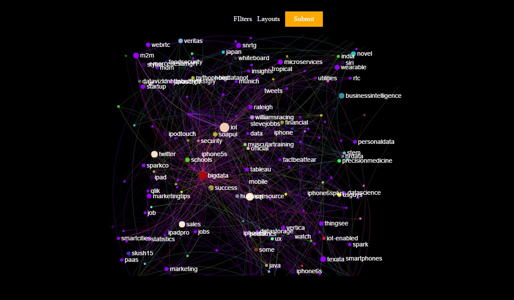
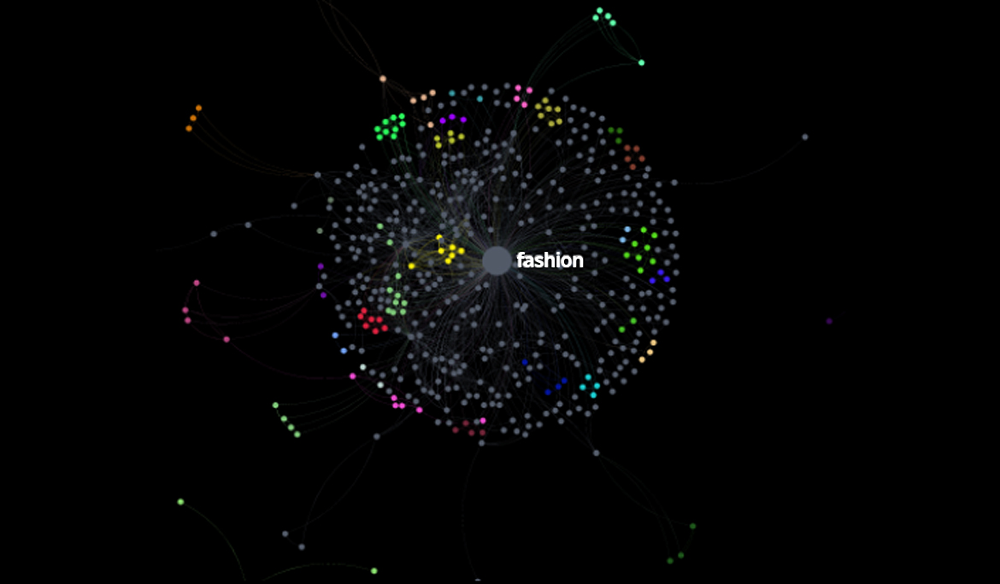

# Twitter Grapher
The purpose of this project is to allow a user to visualize large set of data from multiple data sources.  
     
   
# Installation

Prerequisites

1. Java 8 
2. Maven 

# Adding dependencies

twitter-grapher have some dependencies, so before building the application you've to add them first.

#### Note:

Clone the Project to directory whose path doesn't contain blank spaces.

1. clone the twitter-grapher repository on your machine. 
   `git clone https://github.com/project-spinoza/twitter-grapher.git` 
2. 
To add dependencies run the following commands from the root directory of twitter-grapher

  
`mvn install:install-file -Dfile=src/lib/gephi-toolkit.jar -DgroupId=gephi-toolkit -DartifactId=gephi-toolkit -Dversion=1.0 -Dpackaging=jar`

`mvn install:install-file -Dfile=src/lib/gephi-cw.jar -DgroupId=gephi-cw -DartifactId=gephi-cw -Dversion=0.0.1 -Dpackaging=jar`

`mvn install:install-file -Dfile=src/lib/uk-ac-ox-oii-sigmaexporter.jar -DgroupId=uk-ac-ox-oii-sigmaexporter -DartifactId=uk-ac-ox-oii-sigmaexporter -Dversion=1.0 -Dpackaging=jar`

# How to build the application
1. 
navigate to the twitter-grapher directory and run the following command

  `mvn clean compile package` 

# Running the application

### Running at the command line

run the following command from the root directory

`java -jar target/twitter-grapher-v1.0-fat.jar -conf config.json`

### Running in your IDE (Eclipse)
1. Import twitter-grapher project

`File -> Import -> Existing Maven Projects`

2. Set Configuration file (`config.json`) located in the root directory

In IDE Navigate to `Run -> Run Configurations` then select `Arguments` tab, In the `Program arguments` add the following:

`-conf config.json`

3. 
Run `com.tg.TwitterGrapher.java`

### Open your favorite web browser
Navigate to `http://localhost:8080/graph`
